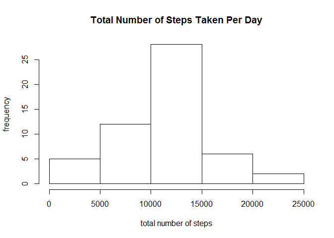
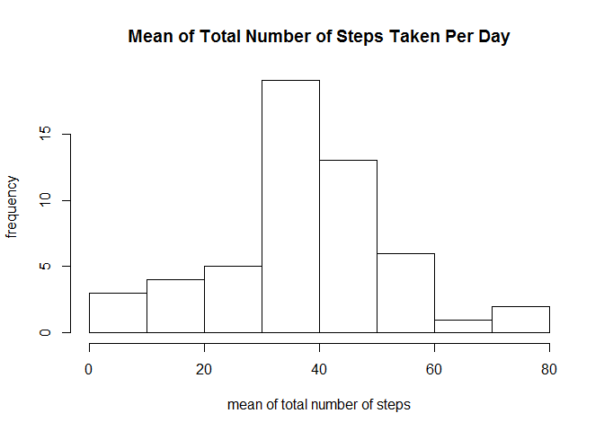
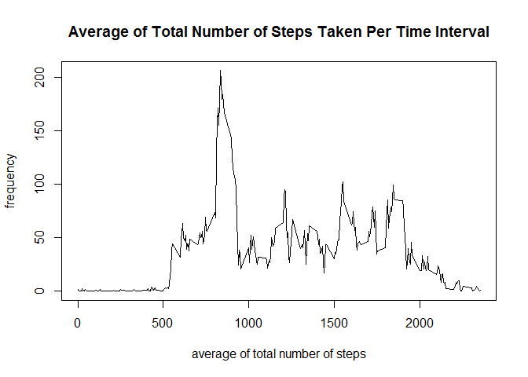
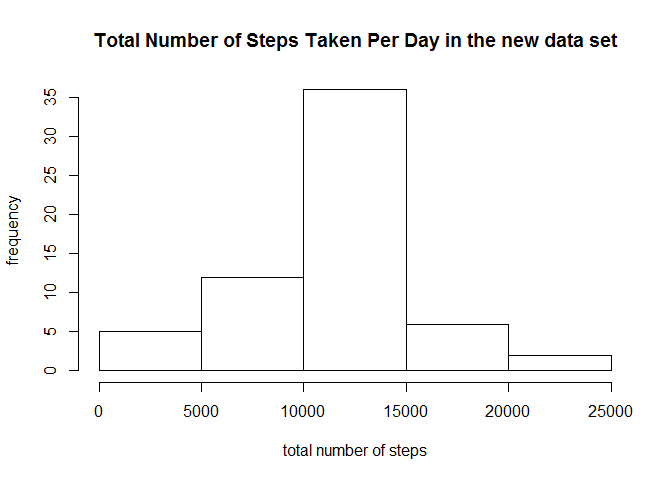

# Reproducible Research Peer Assignment 1
Li Xu  

##Loading and preprocessing the data
The data set can be downloaded from the following website

```R
https://d396qusza40orc.cloudfront.net/repdata%2Fdata%2Factivity.zip
```

After unzipping the file, we read the data by typing (Task 1)

```R
Data<-read.csv("activity.csv",sep=",",header=T)
```

The training data contains 17568 observations with 3 variables (steps, date, interval). The meaning of these three variables are as follows:

* **steps**: Number of steps taking in a 5-minute interval (missing values are coded as NA)

* **date**: The date on which the measurement was taken in YYYY-MM-DD format

* **interval**: Identifier for 5-minue interval in which measurement was taken

Convert the string value of "date" into date format for convenience (Task 2). 

```R
Data$date<-as.Date(Data$date,"%Y-%m-%d")
```

##What is mean total number of steps taken per day?
We ignore the missing values in the dataset and calculate the total number of steps taken per day by typing (Task 1)

```R
DataWithoutNA<-na.omit(Data)
TotalStepsPerDay<-tapply(DataWithoutNA$steps,DataWithoutNA$date,sum,na.rm=T)
```
The histogram of the total number of steps taken per day is as follows: (Task 2)


```r
Data<-read.csv("activity.csv",sep=",",header=T)
Data$date<-as.Date(Data$date,"%Y-%m-%d")
DataWithoutNA<-na.omit(Data)
TotalStepsPerDay<-tapply(DataWithoutNA$steps,DataWithoutNA$date,sum,na.rm=T)
hist(TotalStepsPerDay,main="Total Number of Steps Taken Per Day",
     xlab="total number of steps",ylab="frequency")
```

 

We then calculate the mean and median of the total number of steps per day by 

```R
MeanOfTotalStepsPerDay<-tapply(DataWithoutNA$steps,DataWithoutNA$date,mean,na.rm=T)
MedianOfTotalStepsPerDay<-tapply(DataWithoutNA$steps,DataWithoutNA$date,median,na.rm=T)
```

The means of the total number of steps taken per day are as follows:

```R
2012-10-02 2012-10-03 2012-10-04 2012-10-05 2012-10-06 2012-10-07 2012-10-09 
 0.4375000 39.4166667 42.0694444 46.1597222 53.5416667 38.2465278 44.4826389 
2012-10-10 2012-10-11 2012-10-12 2012-10-13 2012-10-14 2012-10-15 2012-10-16 
34.3750000 35.7777778 60.3541667 43.1458333 52.4236111 35.2048611 52.3750000 
2012-10-17 2012-10-18 2012-10-19 2012-10-20 2012-10-21 2012-10-22 2012-10-23 
46.7083333 34.9166667 41.0729167 36.0937500 30.6284722 46.7361111 30.9652778 
2012-10-24 2012-10-25 2012-10-26 2012-10-27 2012-10-28 2012-10-29 2012-10-30 
29.0104167  8.6527778 23.5347222 35.1354167 39.7847222 17.4236111 34.0937500 
2012-10-31 2012-11-02 2012-11-03 2012-11-05 2012-11-06 2012-11-07 2012-11-08 
53.5208333 36.8055556 36.7048611 36.2465278 28.9375000 44.7326389 11.1770833 
2012-11-11 2012-11-12 2012-11-13 2012-11-15 2012-11-16 2012-11-17 2012-11-18 
43.7777778 37.3784722 25.4722222  0.1423611 18.8923611 49.7881944 52.4652778 
2012-11-19 2012-11-20 2012-11-21 2012-11-22 2012-11-23 2012-11-24 2012-11-25 
30.6979167 15.5277778 44.3993056 70.9270833 73.5902778 50.2708333 41.0902778 
2012-11-26 2012-11-27 2012-11-28 2012-11-29 
38.7569444 47.3819444 35.3576389 24.4687500 
```

We can draw the histogram


```r
Data<-read.csv("activity.csv",sep=",",header=T)
Data$date<-as.Date(Data$date,"%Y-%m-%d")
DataWithoutNA<-na.omit(Data)
MeanOfTotalStepsPerDay<-tapply(DataWithoutNA$steps,DataWithoutNA$date,mean,na.rm=T)
hist(MeanOfTotalStepsPerDay,main="Mean of Total Number of Steps Taken Per Day",
     xlab="mean of total number of steps",ylab="frequency")
```

 

And all medians of the total number of steps taken per day is 0 (Task 3).

##What is the average daily activity pattern?
We calculate the average number of steps taken per 5-minute interval by typing

```R
DataWithoutNA<-na.omit(Data)
MeanofTotalStepsPerInterval<-tapply(DataWithoutNA$steps,DataWithoutNA$interval,mean,na.rm=T)
```
Then we make the time series plot of the 5-minute interval and the average number of steps taken, averaged across all days as follows: (Task 1)


```r
Data<-read.csv("activity.csv",sep=",",header=T)
Data$date<-as.Date(Data$date,"%Y-%m-%d")
DataWithoutNA<-na.omit(Data)
MeanOfTotalStepsPerInterval<-tapply(DataWithoutNA$steps,DataWithoutNA$interval,mean,na.rm=T)
plot(unique(Data$interval),MeanOfTotalStepsPerInterval,type="l",
     xlab="average of total number of steps",ylab="frequency",
     main="Average of Total Number of Steps Taken Per Time Interval")
```

 

By typing

```R
unique(Data$interval)[which.max(MeanOfTotalStepsPerInterval)]
```

We obtain that **8:35** is the 5-minute interval contains the maximum number of steps (Task 2).

##Imputing missing values
We calculate the number of rows containing miss data by typing

```R
sum(is.na(Data))
```
and obtain that there are **2304** missing data (Task 1). We fill in all of the missing values with the mean of number of steps in the corresponding 5-minute interval (Task 2). Then we can create a new data set without missing data as follows: (Task 3)
```R
NewData<-Data
for(index in 1:nrow(NewData)){
  if(is.na(NewData[index,"steps"])){
    i<-match(NewData[index,"interval"],unique(Data$interval))
    NewData[index,"steps"]=MeanOfTotalStepsPerInterval[i]
  }
}
```

The histogram of the total number of steps taken each day in the new data set is as follows:


```r
Data<-read.csv("activity.csv",sep=",",header=T)
Data$date<-as.Date(Data$date,"%Y-%m-%d")
DataWithoutNA<-na.omit(Data)
MeanOfTotalStepsPerInterval<-tapply(DataWithoutNA$steps,DataWithoutNA$interval,mean,na.rm=T)
NewData<-Data
for(index in 1:nrow(NewData)){
  if(is.na(NewData[index,"steps"])){
    i<-match(NewData[index,"interval"],unique(Data$interval))
    NewData[index,"steps"]=MeanOfTotalStepsPerInterval[i]
  }
}
TotalStepsPerDay<-tapply(NewData$steps,NewData$date,sum,na.rm=T)
hist(TotalStepsPerDay,main="Total Number of Steps Taken Per Day in the new data set",
     xlab="total number of steps",ylab="frequency")
```

 

We then calculate the mean and median of the total number of steps per day in the new data set by 

```R
MeanOfTotalStepsPerDay<-tapply(NewData$steps,NewData$date,mean,na.rm=T)
MedianOfTotalStepsPerDay<-tapply(NewData$steps,NewData$date,median,na.rm=T)
```

The means of the total number of steps taken per day in the new data set are as follows:

```R
2012-10-01 2012-10-02 2012-10-03 2012-10-04 2012-10-05 2012-10-06 2012-10-07 
37.3825996  0.4375000 39.4166667 42.0694444 46.1597222 53.5416667 38.2465278 
2012-10-08 2012-10-09 2012-10-10 2012-10-11 2012-10-12 2012-10-13 2012-10-14 
37.3825996 44.4826389 34.3750000 35.7777778 60.3541667 43.1458333 52.4236111 
2012-10-15 2012-10-16 2012-10-17 2012-10-18 2012-10-19 2012-10-20 2012-10-21 
35.2048611 52.3750000 46.7083333 34.9166667 41.0729167 36.0937500 30.6284722 
2012-10-22 2012-10-23 2012-10-24 2012-10-25 2012-10-26 2012-10-27 2012-10-28 
46.7361111 30.9652778 29.0104167  8.6527778 23.5347222 35.1354167 39.7847222 
2012-10-29 2012-10-30 2012-10-31 2012-11-01 2012-11-02 2012-11-03 2012-11-04 
17.4236111 34.0937500 53.5208333 37.3825996 36.8055556 36.7048611 37.3825996 
2012-11-05 2012-11-06 2012-11-07 2012-11-08 2012-11-09 2012-11-10 2012-11-11 
36.2465278 28.9375000 44.7326389 11.1770833 37.3825996 37.3825996 43.7777778 
2012-11-12 2012-11-13 2012-11-14 2012-11-15 2012-11-16 2012-11-17 2012-11-18 
37.3784722 25.4722222 37.3825996  0.1423611 18.8923611 49.7881944 52.4652778 
2012-11-19 2012-11-20 2012-11-21 2012-11-22 2012-11-23 2012-11-24 2012-11-25 
30.6979167 15.5277778 44.3993056 70.9270833 73.5902778 50.2708333 41.0902778 
2012-11-26 2012-11-27 2012-11-28 2012-11-29 2012-11-30 
38.7569444 47.3819444 35.3576389 24.4687500 37.3825996 
```

The medians of the total number of steps taken per day in the new data set are as follows:

```R
2012-10-01 2012-10-02 2012-10-03 2012-10-04 2012-10-05 2012-10-06 2012-10-07 
  34.11321    0.00000    0.00000    0.00000    0.00000    0.00000    0.00000 
2012-10-08 2012-10-09 2012-10-10 2012-10-11 2012-10-12 2012-10-13 2012-10-14 
  34.11321    0.00000    0.00000    0.00000    0.00000    0.00000    0.00000 
2012-10-15 2012-10-16 2012-10-17 2012-10-18 2012-10-19 2012-10-20 2012-10-21 
   0.00000    0.00000    0.00000    0.00000    0.00000    0.00000    0.00000 
2012-10-22 2012-10-23 2012-10-24 2012-10-25 2012-10-26 2012-10-27 2012-10-28 
   0.00000    0.00000    0.00000    0.00000    0.00000    0.00000    0.00000 
2012-10-29 2012-10-30 2012-10-31 2012-11-01 2012-11-02 2012-11-03 2012-11-04 
   0.00000    0.00000    0.00000   34.11321    0.00000    0.00000   34.11321 
2012-11-05 2012-11-06 2012-11-07 2012-11-08 2012-11-09 2012-11-10 2012-11-11 
   0.00000    0.00000    0.00000    0.00000   34.11321   34.11321    0.00000 
2012-11-12 2012-11-13 2012-11-14 2012-11-15 2012-11-16 2012-11-17 2012-11-18 
   0.00000    0.00000   34.11321    0.00000    0.00000    0.00000    0.00000 
2012-11-19 2012-11-20 2012-11-21 2012-11-22 2012-11-23 2012-11-24 2012-11-25 
   0.00000    0.00000    0.00000    0.00000    0.00000    0.00000    0.00000 
2012-11-26 2012-11-27 2012-11-28 2012-11-29 2012-11-30 
   0.00000    0.00000    0.00000    0.00000   34.11321
```

The total number of steps taken per day increases, since the missing data are replaced with some positive numbers. The mean and median of the number of steps are almost the same as those in the original data set. (Task 4)


##Are there differences in activity patterns between weekdays and weekends?

We create a new factor variable "day" in the data set with two levels -- "weekday" and "weekend" indicating whether a given date is a weekday or weekend day, by typing (Task 1)

```R
NewData$day<-c(rep("weekday",nrow(NewData)))
for(index in 1:nrow(NewData)){
  if(weekdays(NewData[index,"date"])=="Saturday"|weekdays(NewData[index,"date"])=="Sunday"){
  NewData[index,"day"]<-"weekend"
  }
}
```

We then draw a panel plot containing a time series plot of the 5-minute interval and the average number of steps taken, averaged across all weekday days or weekend days by typing

```R
NewDataWeekday<-subset(NewData,NewData$day=="weekday")
NewDataWeekend<-subset(NewData,NewData$day=="weekend")
MeanWeekday<-tapply(NewDataWeekday$steps,NewDataWeekday$interval,mean,na.rm=T)
MeanWeekend<-tapply(NewDataWeekend$steps,NewDataWeekend$interval,mean,na.rm=T)
Mean<-c(MeanWeekend,MeanWeekday)
Interval<-c(unique(Data$interval),unique(Data$interval))
Day<-c(c(rep("weekend",length(unique(Data$interval)))), 
    c(rep("weekday",length(unique(Data$interval)))))
FinalPlotData<-data.frame("MeanCol"=Mean,"IntervalCol"=Interval,"DayCol"=Day)
xyplot(MeanCol~IntervalCol|DayCol,data=FinalPlotData,layout=c(1,2),type="l",
    ylab="Number of steps",xlab="Interval")
```

The plot is as follows (Task 2):


```r
library(lattice)
Data<-read.csv("activity.csv",sep=",",header=T)
Data$date<-as.Date(Data$date,"%Y-%m-%d")
DataWithoutNA<-na.omit(Data)
MeanOfTotalStepsPerInterval<-tapply(DataWithoutNA$steps,DataWithoutNA$interval,mean,na.rm=T)
NewData<-Data
for(index in 1:nrow(NewData)){
  if(is.na(NewData[index,"steps"])){
    i<-match(NewData[index,"interval"],unique(Data$interval))
    NewData[index,"steps"]=MeanOfTotalStepsPerInterval[i]
  }
}
NewData$day<-c(rep("weekday",nrow(NewData)))
for(index in 1:nrow(NewData)){
  if(weekdays(NewData[index,"date"])=="Saturday"|weekdays(NewData[index,"date"])=="Sunday"){
  NewData[index,"day"]<-"weekend"
  }
}
NewDataWeekday<-subset(NewData,NewData$day=="weekday")
NewDataWeekend<-subset(NewData,NewData$day=="weekend")
MeanWeekday<-tapply(NewDataWeekday$steps,NewDataWeekday$interval,mean,na.rm=T)
MeanWeekend<-tapply(NewDataWeekend$steps,NewDataWeekend$interval,mean,na.rm=T)
Mean<-c(MeanWeekend,MeanWeekday)
Interval<-c(unique(Data$interval),unique(Data$interval))
Day<-c(c(rep("weekend",length(unique(Data$interval)))),
    c(rep("weekday",length(unique(Data$interval)))))
FinalPlotData<-data.frame("MeanCol"=Mean,"IntervalCol"=Interval,"DayCol"=Day)
xyplot(MeanCol~IntervalCol|DayCol,data=FinalPlotData,layout=c(1,2),type="l",
    ylab="Number of steps",xlab="Interval")
```

 


